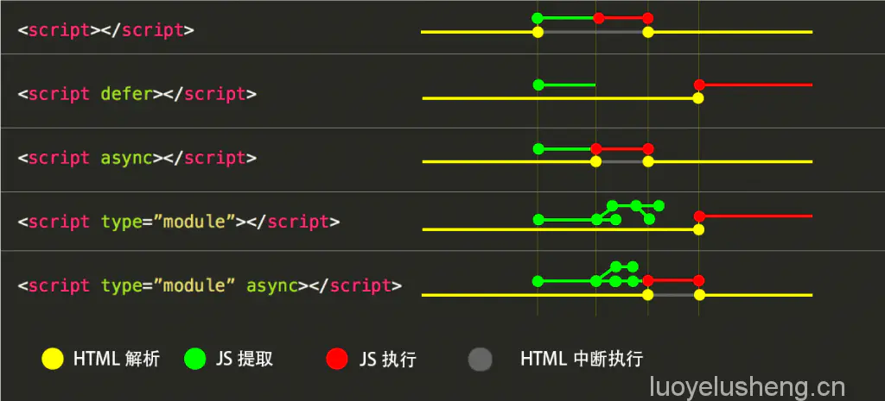

# 性能优化

## 防抖
只要用户不停止触发的动作，事件就一直不触发，直至停止触发动作后一段时间才触发事件。比如滚动条滚动，要等滚动停止一定时间后再执行事件。  

比如：假设一个按钮触发请求列表信息，用户一直不停的点击，就会造成一直不断进行网络请求，这是无意义的，且对用户而言，前端页面会出现列表一直不断刷新的抖动现象，造成不好的用户体验。所以在一这间隔时间内，我们可以只处理**最后一次**点击事件。在执行下一次事件，必须得间隔指定时间后再次触发。
```html
<body>
  <div style="height: 2000px;width: 100px;">
    
  </div>

<script>
  // 防抖，只要用户不停止触发的动作，事件就一直不触发
  // 比如滚动条滚动，要等滚动停止一定时间后再执行事件
  function debounce(fn, delay) {
    let timer = null;
    return function() {
      // 如果已经存在一个定时器，则取消这个定时器
      if(timer) {
        clearTimeout(timer);
      }
      // 并重新根据最新的动作时间，重新设置定时器
      // 在delay时间过后，再执行事件fn
      timer = setTimeout(fn, delay);
    }
  }

  // 这里以滚动显示位置为例子
  function showTop () {
    var scrollTop = document.body.scrollTop || document.documentElement.scrollTop;
    console.log('滚动条位置：' + scrollTop);
  }
  window.onscroll = debounce(showTop, 1000);
</script>
</body>
```

## 节流
在一定时间内，不管用户触发动作几次，事件都只执行第一次触发的事件，要执行下一次事件，得间隔指定时间后，在间隔时间内，其他触发动作将直接无视。   

比如虚拟滚动的场景：只在可视区域才显示相应的内容，即滚动事件中会发起网络请求，但是我们并不希望用户在滚动过程中一直发起请求，而是隔一段时间发起一次，对于这种情况我们就可以使用节流。

```js
// 节流，设置一定的时间阀值，在这个时间内
// 不管用户触发动作几次，事件都只执行第一次
  function throttle(fn, delay) {
    debugger;
    // 是否在执行
    let isExecuting = false;
    return function() {
      // 如果在执行，则什么都不做
      if(isExecuting) {
        return;
        // 如果空闲的，则设置定时器
      }else {
        // 改状态为执行中
        isExecuting = true;
        setTimeout(() => {
          fn();
          isExecuting = false;
        }, delay)
      }
    }
  }

  window.onscroll = throttle(showTop, 1000);
```

## 资源加载的优化
### 异步加载


### 预加载
提前加载资源，当用户需要查看时可直接从本地缓存中渲染  

#### 隐式的预加载
* 图片  
css中的background，js中的Image(new Image)，html中的img标签中src
#### preload  
让浏览器提前加载指定资源(加载后并不执行)，需要执行时再执行。preload 是告诉浏览器页面**必定**需要的资源，浏览器**一定**会加载这些资源
```html
<link rel=“preload” as="style"> 
<!-- 本来优先级都是低的，as可以改变其优先级 -->
```
Preload 的与众不同还体现在 onload 事件上。也就是说可以定义资源加载完毕后的回调函数
```html
<link rel="preload" href="..." as="..." onload="preloadFinished()">
```

* 好处：
  1、将加载和执行分离开，不阻塞渲染和document的onload事件  
  2、提前加载指定资源，不再出现依赖的font字体隔了一段时间才刷出的情况  
* 缺点：使用 preload 后，不管资源是否使用都将提前加载。若不确定资源是必定会加载的，则不要错误使用 preload，以免本末导致，给页面带来更沉重的负担

#### prefetch
```html
<link rel=“prefetch” as="style"> 
<!-- 本来优先级都是低的，as可以改变其优先级 -->
```
它的作用是告诉浏览器加载**下一页面可能**会用到的资源，注意，是下一页面，而不是当前页面。因此该方法的加载优先级非常低，也就是说该方式的作用是加速下一个页面的加载速度。  

prefetch 是告诉浏览器页面**可能**需要的资源，浏览器**不一定**会加载这些资源

两者使用的注意事项：
* 对于当前页面很有必要的资源使用 preload，对于可能在将来的页面中使用的资源使用 prefetch
* preload 和 prefetch 混用的话，并不会复用资源，而是会重复加载。使用 preload 和 prefetch 的逻辑可能不是写到一起，但一旦发生对用一资源 preload 或 prefetch 的话，会带来双倍的网络请求
* 在VUE SSR生成的页面中，首页的资源均使用preload，而路由对应的资源，则使用prefetch
### 懒加载
懒加载即延迟加载，即在要用到时才去加载资源
#### vue中懒加载的应用
1. 组件，又称为异步组件
```js 
Vue.component('AsyncCmp', () => import('./AsyncCmp'))
```
2. 路由器
```js 
new VueRouter({
  routes: [
    { path: '/login', component: () => import('./login') }
  ]
})
```
3. vuex模块
```js 
const store = new Vuex.Store()

// Assume there is a "login" module we wanna load
import('./store/login').then(loginModule => {
  store.registerModule('login', loginModule)
})
```


参考：  
节流、防抖：https://segmentfault.com/a/1190000018428170  
预加载、懒加载：  
* https://www.cnblogs.com/leyan/p/6085148.html  
* https://www.jianshu.com/p/14b4cbce5e27  

SSR: https://www.jianshu.com/p/10b6074d772c  