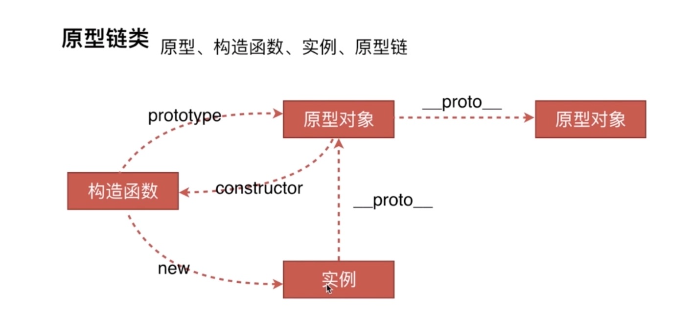

# 原型链相关问题
## 创建对象有几种方法
1. 使用对象字面量的方式创建
  ```js
  // 字面量
  var o1 = {name: "o1"} // {name: "o2"}
  // 下面这种虽然也是构造函数，但生成的对象本质上和上面字面量相同 
  var o2 = new Object({name: "o2"}) // {name: "o2"}
  ```
2. 使用构造函数创建对象
  ```js
  var M = function(name){this.name = name}
  var o3 = new M("hhh") // M {name: "hhh"}
  ```

3. 使用Object.create()方法创建
  ```js
  var p = {name: "p"}
  var o4 = Object.create(p)  // {}
  console.log(o4.name) // p
  ```
## 原型、构造函数、实例、原型链
概念：
* 原型: 原型是函数对象的一个prototype属性（公有属性），它定义了构造函数制造出的对象（实例对象）的公共祖先。通过构造函数产生的实例对象，可以继承该原型的属性和方法
* 构造函数：使用new，这个函数就是构造函数
* 实例：通过构造函数创建的对象，就称为实例
* 原型链：原型链是指从当前对象的原型中，一直往其上的原型遍历，直至Object的原型，这条链称为原型链 

它们之间的关系:

1. 构造函数通过new来创建实例  
    如上面的例子，o2就是实例
2. 实例的__proto__就是构造函数的prototype,也就是我们说的原型对象，原型对象是被不同的实例所共同拥有的
```js
  o3.__proto__ === Person.prototype // true
  Person.prototype.constructor === M // true
```
3. 只有构造函数有prototype属性，而只有实例对象有__proto__属性，如果发现函数既有prototype属性，也有__proto__属性，说明这个函数既是一个构造函数，又是一个实例对象
```js
  M.__proto__ === Function.prototype // M是Function的实例对象
  o3.__proto__ ===  M.prototype // 又是o3实例对象的构造函数
```

## instanceof的原理
instanceof的原理是查找构造函数的 prototype 属性是否出现在对象原型链上
```js
  o3 instanceof M // true
  o3.__proto__ === M.prototype // true
  o3 instanceof Object // true
  M.prototype.__proto__ === Object.prototype //true

  // 要判断o3是M还是Object的实例，可以使用constructor来判断，使用constructor来判断会比instanceof严谨
  o3.__proto__.constructor === M  // true
  o3.__proto__.constructor === Object // false
```
```js
// js实现instanceof,L为实例对象，R为构造函数
const instanceofFunc(L, R) {
  const left = L.__proto__
  const right = R.prototype
  while(true) {
    if(left === null) {
      return false
    }else {
      if(left === right) {
        return true
      }else {
        left = left.__proto__
      }
    }
  }
}
```
## new运算符
原理：
1. 一个新对象{}被创建
2. 将新对象的原型链接到构造函数的原型链上
3. 将构造函数的this指向新对象，并执行构造函数
4. 执行结果如果返回一个对象，而返回这个对象，否则返回第2步创建的新对象    
 
```js
  // 实现一个new方法 
    var new2 = function(func) {
      // 这一步相当于, 创建一个新对象{}，并将新对象的__proto__链接到func的原型链上，即o.__proto__ === func.prototype
      var o = Object.create(func.prototype)
      var k = func.call(o)
      if(typeof k === 'object') {
        return k
      }else {
        return o
      }
    }
````